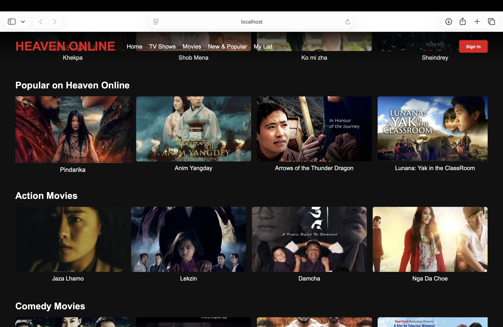
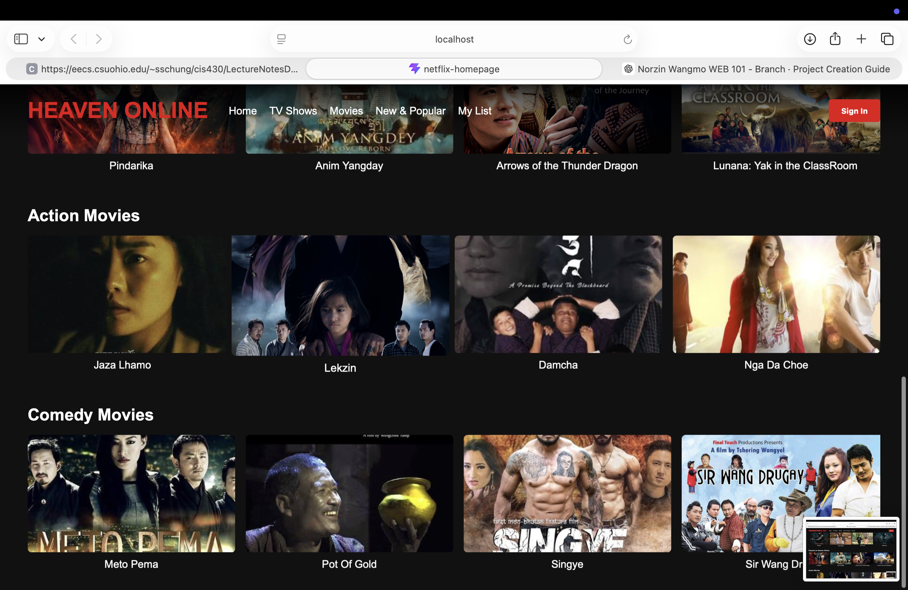

# Netflix Homepage Clone

**Student:** Norzin Wangmo  
**Module:** WEB101 — Practical Assignment 1  
**Repository:** [02250359_WEB101_PA1](https://github.com/norzin-wangmo/02250359_WEB101_PA1.git)

---

## Project Overview

This is a React-based **Netflix homepage clone** that recreates the Netflix browse/home screen as a single-page experience. The project demonstrates component-based architecture, responsive layout, and **fully interactive** frontend behavior using React hooks and plain CSS.

This assignment required one webpage from an existing application — a separate login page or multi-route app was not required. Sign-in and movie browsing are handled on the same page through modals, state, and user actions.

---

## Defined Functionality

The application achieves the following:

| Feature | Description |
|--------|-------------|
| Hero banner | Featured title (*Pindarika*) with hover video preview and Play with sound |
| Movie rows | Four categories driven by static data in `movies.js` |
| Search | Real-time filter by movie title across all rows |
| Navigation | Navbar links scroll to the matching section |
| Sign In / Sign Out | Modal with validation; displays user greeting when signed in |
| My List | Add/remove movies via **+** button; persisted in `localStorage` |
| Movie details | Click a poster or **More Info** to open a detail modal |
| Row controls | **‹ ›** buttons scroll each row horizontally |
| Feedback | Toast notifications for play, list, and auth actions |
| Responsive UI | Layout adapts for desktop, tablet (≤992px), and mobile (≤768px) |

---

## Features

- Hero banner with hover video preview (Pindarika)
- Reusable movie row and card components
- Fully responsive design (desktop, tablet, mobile)
- Netflix-inspired dark UI
- Interactive state managed in `App.jsx` (no external UI libraries)

---

## Component Explanation

### 1. `App.jsx`
- Root component; holds shared state (`userName`, `searchQuery`, `myListIds`, selected movie, modals)
- Passes data and callbacks to children via **props**
- Saves My List to `localStorage` so it persists after refresh

### 2. `Navbar.jsx`
- Brand logo, navigation links, search input
- **Sign In** opens modal; after login shows greeting and **Sign Out**

### 3. `HeroBanner.jsx`
- Featured movie from `featuredMovie` in `movies.js`
- `useRef` + `useState` control hover video (muted) and Play with sound
- **More Info** opens the movie detail modal

### 4. `MovieRow.jsx`
- Receives `title` and `movies` as props
- Maps data to `MovieCard` with unique `key={movie.id}`
- Scroll buttons move the row using `useRef` and `scrollBy`

### 5. `MovieCard.jsx`
- Click poster → opens detail modal
- **+** button toggles My List without opening the modal

### 6. `SignInModal.jsx` & `MovieModal.jsx`
- Overlay modals for authentication and movie details
- Close on **×** or clicking outside the modal

### 7. `movies.js`
- Static data source (no backend API)
- Exports: `featuredMovie`, `trendingMovies`, `popularMovies`, `actionMovies`, `comedyMovies`

---

## App States & Error Codes

### States (`appStates.js`)
| State | Meaning |
|-------|---------|
| `loading` | Movies are being fetched (simulated API) |
| `success` | Data loaded; main UI is shown |
| `error` | Something failed; banner shows message |
| `idle` | Form ready (used in Sign In modal) |

### Error codes (`errorCodes.js`)
| Code | When it happens |
|------|-----------------|
| `200` | Success |
| `4001` | Empty email/password |
| `4002` | Password too short |
| `4003` | Invalid email format |
| `4010` | My List used without sign in |
| `4040` | Search returned no movies |
| `5001` | Movies failed to load |
| `5002` / `5003` | localStorage read/write failed |
| `5004` | Hero video could not play |

`movieService.js` simulates a backend call today; later replace it with `fetch('/api/movies')` and use the same codes from the server.

---

## Implementation Decisions

### React + Vite
Vite was chosen instead of deprecated Create React App for fast dev server and modern React support.

### Component-based design
Each UI section has a single responsibility. `MovieRow` and `MovieCard` are reused for every category.

### State in `App.jsx`
Login, search, My List, and modals live in the parent so all components stay in sync.

### Hero video on one title only
Video is limited to **Pindarika** in the hero to avoid loading many large files and keep performance reasonable.

### Custom CSS (no Bootstrap/Tailwind)
Layout, responsiveness, and Netflix-style styling were written manually to practise CSS and media queries.

### Browser video policy
Hover uses **muted** autoplay; sound plays only after the user clicks **Play** (browser autoplay rules).

---


## Problems Faced & Solutions

| Problem | Solution |
|--------|----------|
| Blank screen / import errors | Fixed JSX syntax and component import paths |
| Images not loading | Used Vite imports for hero assets; consistent paths in `movies.js` |
| Video not playing on hover | Added `useRef`, `play()`, muted autoplay, and `try/catch` |
| UI not “fully functional” | Added sign-in modal, search, My List, modals, scroll buttons, and toast feedback |
| Footer missing from layout | Imported and rendered `<Footer />` in `App.jsx` |

---

## Third-Party Dependencies

- **React** — UI components and hooks
- **Vite** — build tool and dev server

No extra UI libraries were used so the focus stays on core React and CSS.

---

## How to Run

```bash
cd netflix-homepage
npm install
npm run dev
```

Open: `http://localhost:5173/`

---

## Reflection

### What I set out to do
My goal was to recreate the Netflix homepage look while proving I understand React — components, props, state, and events — not only static HTML/CSS.

### What went well
Breaking the page into **Navbar**, **HeroBanner**, **MovieRow**, and **MovieCard** made the code easier to manage. Once I moved shared logic into `App.jsx`, features like search and My List worked across the whole page. The hero video was the most interesting part: learning `useRef` to control the `<video>` element and why browsers require muted autoplay on hover helped me understand real browser behaviour, not just tutorials.

### Challenges
I faced several issues during development: import path mistakes caused a blank screen; image paths needed careful handling with Vite; and video playback failed until I controlled it manually with refs and async `play()`. When my instructor asked for a **fully functional** app, I extended the project with modals, `localStorage`, and user feedback instead of only visual design — that taught me how much **state management** matters in React.

### What I learned
- How parent–child communication works through **props** and **callbacks**
- When to use **`useState`** (UI visibility, user, lists) vs **`useRef`** (DOM/media control)
- How to debug using the browser console and small, step-by-step fixes
- Responsive design with **media queries** for tablet and mobile
- That a good assignment demo needs **working interactions**, not only a pretty layout

### What I would improve next
With more time I would add React Router for separate pages, connect to a real movie API, improve accessibility (keyboard focus, ARIA labels), and lazy-load images for better performance. A backend for real authentication would be the next step beyond frontend-only sign-in.

### Conclusion
This project started as a UI clone and became a practical lesson in React architecture, debugging, and user interaction.

---

## Learning Outcomes

- React component structure and reusability
- State, events, refs, and conditional rendering
- Responsive CSS and media queries
- Debugging import, asset, and media playback issues
- Building interactive UI without heavy third-party libraries

---

## Screenshots

  
  


---

## Repository Link

👉 [PA1_WEB101](https://github.com/norzin-wangmo/02250359_WEB101_PA1.git)
